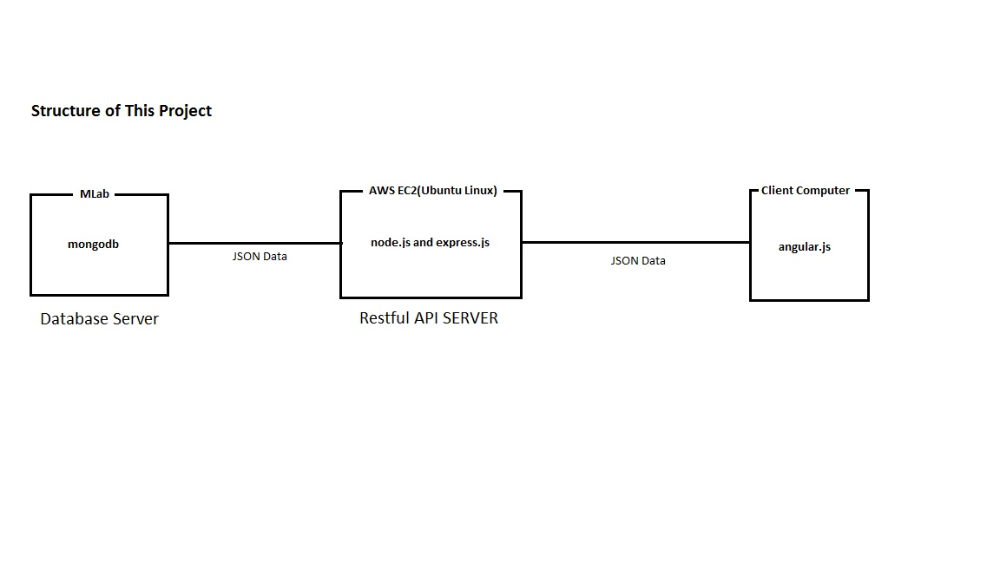

# Mini-Instagram

## Web site
- https://mini-instagram.com

## Team
- Donghoon Oh

## Description
After I finished the book Getting Mean with Mongo, Express, Angular, and Node, I wanted to build a web server 
using this technique. I wanted to test my knowledge and skill, so I decided to build Mini-Instagram server.
This server provides https connection to clients which protect from other user seeing your information. A user
can register for an account and can login after registration. A user password does not directly stored into
database. the server will combine the user password with salt and encrypt it, so even if someone successfully
hack my database, it will show encrypted password and protect user's password. A user can register, login, post
pictures, delete pictures, leave comments and visiting other user's page.

## How to use
- on the top right corner, there are register button and login button.
  - a user can register for a user account and login
- after login, the button on the top right corner changed to your userid.
  - Click account setting.
    - You can change your password
    - You can make your photo public(everyone can see) or private(only you can see)
    - You can delete your account
  - Click Profile on the left panel
    - You can change your name, description and email
  - Click My home page button on the top right corner
    - You can see your profile and your picture
    - You can post picture by click the blue button
    - You can delete picture by click your photo, type delete, and click Delete
  - On the home page, you can see other user's pictures(if their account is public), Click any picture
    - You can see pop up Modal
      - If this user interested you, you can visited his/her page by clicking the name on the top left corner
    - You can leave comments to other user
    - If you want to visit the user who leave comment, just Click his/her name.
- You can log out by Clicking the button on the top right corner

## Technologies
- Client Computer(View): angular.js, bootstrap
- Restful API Server(controller): AWS EC2(Ubuntu Linux), node.js, express.js, mongoose, jsonwebtoken
- Database Server(Model): MLab, mongodb

## Structure of This Project


## Issue
- photos do not align well. because I do not have strong knowledge about front-end programming, I did not solve
this problem
- Image uploaded by iphone rotated left on a desktop computer, but if I look at the the website on iphone everything
is OK

## Programming Challenge
- After I implemented function for posting and deleting picture, I decided to moved on to follow-system.
When a user send follow request to other user(I refer to a user who send request as S, 
and a user who received request as R), S's request stored into S's followerRequestQueue.
When R log in to the web site, the server send the number of request in the followerRequestQueue to R.
After R notice that some user send request to him, R would click it, and the server sends the whole list
of followerRequestQueue to R. R can decides to deny some people and to accept some people as followers.
When R accept the request, the server take out S from R's followerRequestQueue and put S into R's followerAcceptedList.
Also, the server has to put R into S's followingList. So, the server has to change user S and R at the same, 
This operation is called transaction, and this must be Atomic operation. However, I found out that mongodb and
mongoose does not support atomic transaction. So, I gave up to implement following-sytstem, and moved on to comments system

## How to install
````
required: node.js, linux OS, amazon account for ec2, mlab account for dababase

1. I use Ubuntu 16.04.4 for this project

2. create an account on AWS, and choose EC2
    - on the top right, choose region you would like(I choose Oregon)
    - Click Instances on the left bar menu
    - in the main, CLICK "Launch Instance"
    - Select any Linux instance (I choose Ubuntu Server 16.04 LST (HVM), SSD Volume Type)
    - Choose  t2.micro because it is Free tier
    - Click "Review and Launch" on the bottom right
    - Click "Launch"
    - Choose "Create a new key pair"
    - Choose the name of you Key pair name. I named it as aws-dev-app-server
    - Click "Download Key Pair"
          (Becareful, if you loose this key, you cannot download this key again, thus you cannot connect to this instance)
    - Click "launch"
    - Click "view instance"
    - Wait for the instance to be initialized.
    - while waiting for the initializing, go to "Security Groups" on the left bar
    - choose your instance
    - on the bottom, CLICK "Inboud", and Click "Edit"
    - Click "Add Rule"
    - Choose "Custom TCP" for type, and "3001" for Port Range(because our node.js app use port 3001)
    - Click "SAVE"
    - After initializing has been done, remember your IPv4 Public IP address of your instance
    - Open console terminal, change permission of your private key
          ENTER chmod 400 YOUR_PRIVATE_KEY_FILE_NAME
    - ssh -i /PATH_TO_YOUR_KEY/YOUR_KEY.pem ubuntu@YOUR_IP_ADDRESS_HERE
          (I chosen ubuntu for the instance, but if you chosen other instance, you have to change "ubuntu" to yours)


3. install node.js and npm (go to website and follow the steps)
    - I followed the instruction below
    - https://nodejs.org/en/download/package-manager/#debian-and-ubuntu-based-linux-distributions


4. We need mongodb to store our data. We are going to use MLAB
    - Create an account, on https://mlab.com
    - CLICK Create new
    - CLICK any Cloud Provider among Amazon, Google, and Microsoft
    - CLICK sandbox, because it is free up to 0.5 GB
    - CLICK any region you prefer and Continue.
          (I choose Microsoft, becuase it provide server on WEST US which is really close to my mini-instagram API server)
          API server and DATABASE server transfer data a lot, so I want to reduce the amount of time for transferring data
    - ENTER "YOUR_DATABSE_NAME". I choose "mini-instagram"
    - Wait for your database to be ready
    - After your database is ready, click the database you just created
    - CLICK Users, and CLICK Add database user
          This is DIFFERENT from your MLAB login user.
          This database user is just for connecting to your specific database.
    - CHOOSE your user name and password.
    - After create your database user, you can see mongodb://<dbuser>:<dbpassword>@dsXXXXX.mlab.com:XXXXX/YOUR_DATABASE
    - replace <dbuser> with your database username
    - replace <dbpassword> with your database password
    - this mongodb address will be used later on step 10

5. install git on your AWS_INSTANCE
    - ENTER sudo ap-get install git

6. We need to download our mini-instagram app server from git
    - on the terminal of your AWS_SERVER, ENTER git clone https://github.com/ohdonghoon1128/mini-instagram.git

7. AFter download mini-instagram, ther will be mini-instagram directory on your AWS_SERVER
    - on YOURHOME/mini-instagram, ENTER mkdir ssl

8. on YOURHOME/mini-instagram/ssl, ENTER openssl req -x509 -nodes -days 365 -newkey rsa:2048 -keyout mini-instagram.pem -out mini-instagram.crt
    - This will create your public key and private key required to the secure connection(ex: https)
    - We do not want other people see our information while transfering data through the internet.
    - This will protect our data

9. on YOURHOME/mini-instagram, CREATE file named ".env"

10. .env must contains the three lines below this, and YOUR_MLAB_URI is what you got from at the end of step 4
    NODE_ENV="production"
    MLAB_URI="YOUR_MLAB_URI"
    JWT_SECRET="WRITE_DOWN_ANYTHING_YOU_WANT_BUT_AVOID_SPECIAL_CHARACTERS"

11. on YOURHOME/mini-instagram, ENTER npm install
    - this will install node_moduels dependencies

12. on YOURHOME/mini-instagram/app_api/controllers/photo.js, change the value of PHOTO_API_URL to 'https://YOUR_API_SERVER_URL:3001/api/photo/'
    - YOUR_API_SERVER_URL is the IPv4 address you got from step 2
    - we separate DATABASE server and API server, so do not confuse with MLAB_URI from stemp 4


13. on YOURHOME/mini-instagram, ENTER node app
    - it will run your server, and you can visit your mini-instagram on browser.
    - OPEN any web browser, and ENTER https://YOUR_API_SERVER_URL:3001


14. everything good, but if you exit the terminal to the amazon-ec2-linux, you cannot visit your 'https://YOUR_API_SERVER_URL:3001'
    - This is because, when you connect to amazon-ec2-linux,
      the OS's login daemon will create a process for your connection to the OS
      So if you disconnect the terminal to the OS, the OS will kill the process,
      and because your mini-instagram API server is running under your initial process,
      your mini-instagram API server process also be killed as well.

15. to prevent this problem, we must make our mini-instagram API server to be a direct child process of the OS

16. on /etc/systemd/system, create file named mini-instagram.service
    - this director may required you to have root privilege, so you might need "sudo" command
      ex) sudo vim mini-instagram.service

17. Write these content to mini-instagram.service and change the value of WorkingDirectory to your mini-instagram directory

    [Unit]
    Description=MINI_INSTAGRAM
    # Set dependencies to other services (optional)
    #After=mongodb.service

    [Service]
    # Run Grunt before starting the server (optional)
    #ExecStartPre=/usr/bin/grunt

    # Start the js-file starting the express server
    ExecStart=/usr/bin/node app.js
    WorkingDirectory=/YOUR_ABSOLUTE_PATH_TO_YOUR_MINI_INSTAGRAM_DIRECTORY
    Restart=always
    RestartSec=10
    StandardOutput=syslog
    StandardError=syslog
    SyslogIdentifier=MINI_INSTAGRAM
    # Change to a non-root user (optional, but recommended)
    #User=<alternate user>
    #Group=<alternate group>
    # Set environment options
    #Environment=NODE_ENV=production PORT=3001
    Environment=NODE_ENV=production PORT=3001

    [Install]
    WantedBy=multi-user.target


18. more detail on https://expressjs.com/en/advanced/pm.html, section System D

19. now we are ready to create mini-instagram process
    ENTER sudo systemctl enable mini-instagram.service
    ENTER sudo systemctl start mini-instagram.service
    ENTER systemctl status mini-instagram.service

20. check if mini-instagram.service is running

21. you can exit the terminal

22. now you can visit your mini-instagram site
````
